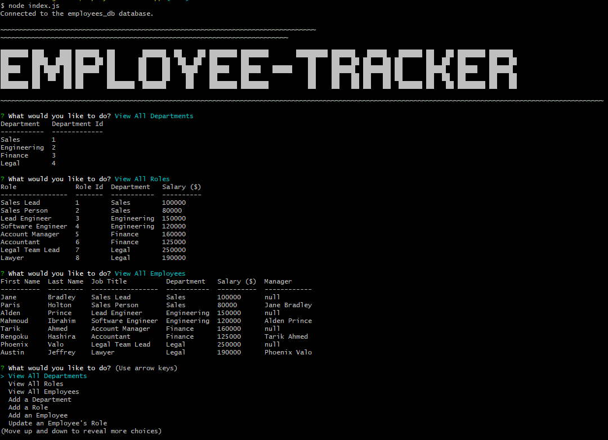

# employee-tracker-app

## Description

This is a command-line application that may do a variety of tasks in relation to an employee database. It see the departments, jobs, and workers that are currently in place. It can also create new departments, positions, and personnel, as well as delete them. It can also be used to change an employee's job.

> Github Repository Link: [https://github.com/nevan-dsouza/employee-tracker-app](https://github.com/nevan-dsouza/employee-tracker-app)
>
> Video Link: 

## Table of Contents

1. [Installation](#installation)
2. [Usage](#usage)
3. [Example](#example)
4. [License](#license)
5. [Questions](#questions)

## Installation

Type "npm install" in the console to install the dependancies this application requires (Inquirer, MySQL2, and console.table package). 

## Usage

In order to run this program, the user must type "node index.js" in their console. The program will only work if they have a running sql database with the schema used in the db folder, otherwise the program will not know what you're talking about, since it relies on a connection to the employees_db database provided.

## Example

### Screenshot of the Program Running (View Tables)

### Video Demonstration (Add/Update Tables)

## License

This project is not under any license.

## Questions

My GitHub Page: [Bickolus](https://github.com/nevan-dsouza)
